# 📊 GitHub Statistics

[](https://github.com/developerdiegorodrigues/github-statistics/actions/workflows/update-stats.yml)

Repositório para hospedagem de estatísticas do GitHub com **atualização automática diária** via GitHub Actions.

## 🎯 Problema Resolvido

APIs de estatísticas do GitHub (como GPRM) frequentemente ficam indisponíveis, deixando o README com aparência "quebrada". Este repositório resolve isso:

- ✅ **Hospedagem própria** dos SVGs no GitHub Pages
- ✅ **Atualização automática** diária via GitHub Actions  
- ✅ **Fallback inteligente** - mantém versão anterior se a API falhar
- ✅ **Validação de SVG** - só atualiza se o arquivo for válido
- ✅ **Zero dependência externa** em tempo de exibição

---

## 🚀 Como Usar no Seu README

### URLs Disponíveis

Após habilitar o GitHub Pages, use estas URLs no seu README:

```markdown
<!-- Streak Stats -->


<!-- Most Used Languages -->


<!-- Contributor Stats -->

```

### Preview

| Stat | Preview |
|------|---------|
| **Streak Stats** |  |
| **Most Used Languages** |  |
| **Contributor Stats** |  |

---

## ⚙️ Configuração do GitHub Pages

1. Vá em **Settings** → **Pages** no repositório
2. Em **Source**, selecione **Deploy from a branch**
3. Selecione a branch `main` e pasta `/ (root)`
4. Clique em **Save**

Após alguns minutos, os SVGs estarão disponíveis em:
```
https://developerdiegorodrigues.github.io/github-statistics/
```

---

## 🔄 Atualização Automática

O workflow executa **diariamente às 06:00 UTC (03:00 BRT)** e:

1. 📥 Baixa os SVGs atualizados das APIs originais
2. ✅ Valida se os arquivos são SVGs válidos
3. 🔄 Usa fallback (versão anterior) se a API falhar
4. 💾 Faz commit apenas se houver alterações

### Executar Manualmente

Você pode forçar uma atualização a qualquer momento:

1. Vá em **Actions** → **Update GitHub Stats SVGs**
2. Clique em **Run workflow**

---

## 🎨 Customização

Para alterar o tema ou parâmetros dos SVGs, edite o arquivo [.github/workflows/update-stats.yml](.github/workflows/update-stats.yml).

### Parâmetros Disponíveis

#### Streak Stats
```
theme, hide_border, stroke, ring, fire, currStreakLabel, background, border
```

#### Most Used Languages  
```
theme, hide_border, layout, bg_color, title_color, text_color, border_color
```

#### Contributor Stats
```
theme, limit, combine_all_yearly_contributions, hide_border, bg_color, title_color, text_color, border_color
```

---

## 📁 Estrutura do Repositório

```
github-statistics/
├── .github/
│   └── workflows/
│       └── update-stats.yml    # Workflow de atualização
├── contributor-stats.svg        # Stats de contribuições
├── github-readme-streak-stats.svg # Stats de streak
├── MostUsedLanguages.svg        # Linguagens mais usadas
├── LAST_UPDATED.txt             # Timestamp da última atualização
└── README.md                    # Este arquivo
```

---

## 📜 Licença

Este projeto está sob a licença MIT. Sinta-se livre para usar e adaptar!

---

<div align="center">
  <sub>Feito com ❤️ por <a href="https://github.com/developerdiegorodrigues">Diego Rodrigues</a></sub>
</div>
