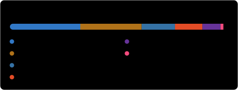
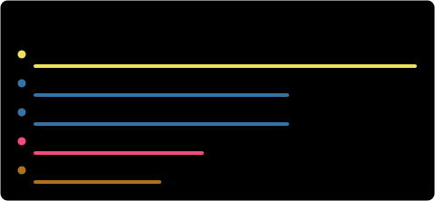

# 📊 GitHub Statistics

[](https://github.com/developerdiegorodrigues/github-statistics/actions/workflows/atualizar-stats.yml)

Gerador dos SVGs do meu perfil do GitHub — banner e cards de estatística. Os dados vêm da
API GraphQL do GitHub, a geração roda em GitHub Actions e os arquivos são servidos por
GitHub Pages — **nenhum serviço de terceiros participa, nem na geração nem na exibição.**

## Cards de estatística

| | |
|---|---|
| **Contribuições** |  |
| **Linguagens** |  |
| **Repositórios** |  |


## Banner


Versão alternativa, sem texto, com o padrão *smart-termite* herdado do app:


Os dois são estáticos: não consomem `dados/*.json`. O avatar vai **embutido como data URI**,
e isso não é escolha estética — um SVG carregado via ``, que é como o GitHub renderiza
imagem de README, roda em modo estático seguro e o navegador bloqueia todo recurso externo.
Um `<image href="https://…">` simplesmente não apareceria. A validação recusa qualquer
`<image>` cujo `href` não seja embutido, para essa armadilha não voltar.

## Por que existe

A versão anterior baixava SVGs prontos de três serviços da comunidade
(`github-readme-streak-stats`, `github-readme-stats`, `github-contributor-stats`) e guardava
cópias. Quando um desses serviços falhava, ele devolvia um **card de erro** — que também é um
SVG válido, e por isso passava pela validação `grep '<svg'` e era commitado por cima da cópia
boa. O perfil acabava exibindo *"Failed to retrieve contributions"*.

Agora não há de quem depender: os números saem da API do próprio GitHub e o desenho é feito aqui.

## Como funciona

```
API GraphQL do GitHub
        │
        ▼
scripts/coletar.mjs     →  dados/*.json     (agregados, versionados)
        │
        ▼
scripts/renderizar.mjs  →  svg/*.svg        (função pura, sem rede)
        │
        ▼
scripts/validar.mjs     →  aprova ou derruba o job
        │
        ▼
commit + GitHub Pages
```

A separação em três etapas é o que permite ajustar o visual sem gastar chamada de API: o JSON
guarda o agregado completo e a renderização decide o que mostrar.

### Validação

Um card só é commitado se passar em todas as checagens de `scripts/validar.mjs`:

1. XML bem formado (balanceamento real de tags, não `grep`)
2. Dimensões esperadas — 480px de largura nos cards, para alinharem no README; o banner
   declara as suas próprias
3. Presença dos marcadores de conteúdo esperados
4. Ausência de padrões de falha (`failed to`, `error`, `undefined`, `NaN`…)
5. Menos de 100 KB
6. **Nenhuma URL externa** além dos namespaces obrigatórios do SVG
7. **Nenhum `<image>` com `href` externo** — não renderizaria no README
8. Nenhum nome de repositório privado exposto

Se qualquer uma falhar, o job falha em vermelho e **nada é commitado** — o Pages continua
servindo os SVGs da execução anterior. Falha visível em vez de card quebrado.

## URLs públicas

O banner foi desenhado para ocupar 100% da largura, então vale a tag ``:

```markdown


```

## Rodar localmente

Sem `npm install`: os scripts usam só a biblioteca padrão do Node 20.

```bash
export STATS_TOKEN=$(gh auth token)
node scripts/coletar.mjs      # API  -> dados/*.json
node scripts/renderizar.mjs   # dados -> svg/*.svg
node scripts/validar.mjs      # portão de qualidade
```

Para mexer só no visual, pule a coleta: `renderizar.mjs` trabalha em cima do JSON já versionado.

## Configuração

Tudo em [`scripts/config.mjs`](scripts/config.mjs):

| Opção | O que faz |
|---|---|
| `usuario` | Login do GitHub analisado |
| `fuso` / `offsetFuso` | Fuso usado para fatiar o calendário em dias e calcular a sequência |
| `privadosNasLinguagens` | Soma os bytes dos repositórios privados (sem expor nome algum) |
| `privadosNosDestaques` | Se nomes de repositórios privados podem aparecer. **Mantenha `false`** |
| `topLinguagens` / `topRepositorios` | Quantos itens cada card mostra |
| `ignorarLinguagens` | Linguagens que não representam código autoral |
| `ignorarRepositorios` | Repositórios fora do ranking de destaques |

A aparência (cores, tipografia, animações) fica em [`scripts/tema.mjs`](scripts/tema.mjs), e
todo texto visível em [`scripts/i18n.mjs`](scripts/i18n.mjs).

## Token

O `GITHUB_TOKEN` padrão do Actions é escopado por repositório e não serve para consultas de
escopo de usuário. É preciso um **PAT clássico** com `read:user` e `repo`, cadastrado como o
secret `STATS_TOKEN` em *Settings → Secrets and variables → Actions*.

> PAT clássico expira. Quando expirar, o workflow falha em vermelho e o perfil continua
> mostrando os últimos SVGs válidos — dá tempo de renovar sem nada quebrar.

## Estrutura

```
github-statistics/
├── .github/workflows/
│   ├── atualizar-stats.yml    # coleta, renderiza, valida, commita
│   └── deploy-pages.yml       # publica no GitHub Pages
├── scripts/
│   ├── config.mjs             # o que é analisado e o que é mostrado
│   ├── github.mjs             # cliente GraphQL (retry, rate limit)
│   ├── coletar.mjs            # único ponto que fala com a rede
│   ├── renderizar.mjs         # dados -> svg
│   ├── validar.mjs            # portão de qualidade
│   ├── tema.mjs               # tokens visuais e casca do card
│   ├── i18n.mjs               # textos e formatação pt-BR
│   ├── imagem.mjs             # embute imagem como data URI
│   └── cards/                 # um módulo por SVG gerado
├── assets/
│   ├── avatar_x300.webp       # embutido nos banners
│   ├── icones/                # Material Symbols de origem
│   └── referencia/            # o banner original do app
├── dados/                     # agregados em JSON
├── svg/                       # o que é publicado
└── reference/Plan_v2.md       # o plano desta refatoração
```

## Licença

MIT.

---

<div align="center">
  <sub>Feito com ❤️ por <a href="https://github.com/developerdiegorodrigues">Diego Rodrigues</a></sub>
</div>
